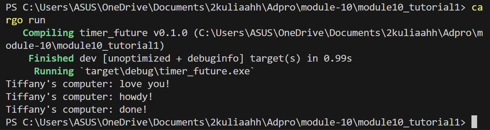
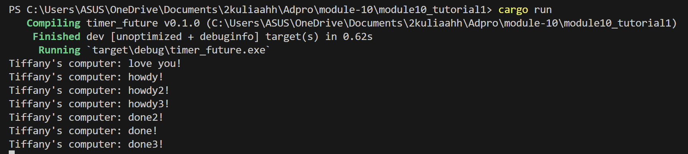

## 1.2. Understanding how it works.

 
Pada gambar di atas terlihat bahwa text tambahan "love you!" di print duluan baru dilanjut dengan text async. Ini dikarenakan text tambahan tersebut tidak masuk ke dalam fungsi async, saat fungsi async menggunakan future. Makanya text barunya keluar terlebih dahulu karena tidak menunggu future.

## 1.3 Multiple Spawn and removing drop

 
spawner merupakan fitur atau mekanisme yang secara dinamis membuat atau "membangkitkan" proses atau thread baru. Maka dari itu saat dilakukan drop spawner juga akan otomatis mematikan program. Pada kasus di atas saat drop spawner dihapus, maka program tidak akan mati karena dikira masih ada sata yang akan dikirimkan. 